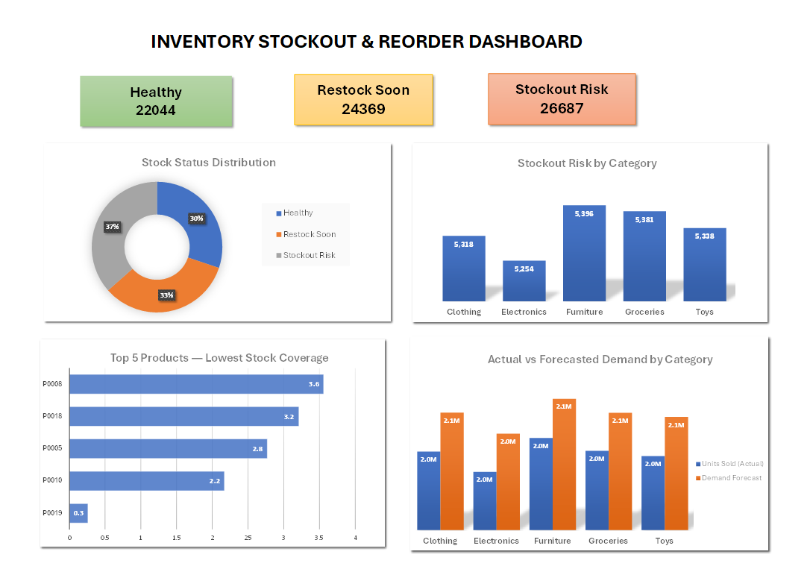

# Inventory Risk and Demand Analysis Dashboard

## Project Overview

An Excel-based inventory analytics dashboard built using a synthetic retail inventory dataset containing 73,100 daily records.

The dashboard analyzes inventory health, stockout risk, stock coverage, and actual versus forecasted demand to support inventory monitoring and decision-making.

## Tools & Techniques

- Microsoft Excel
- PivotTables
- PivotCharts
- Conditional Formatting
- Excel Formulas
- Data Analysis

## Dashboard

## Key Analysis

- Classified inventory records into Healthy, Restock Soon, and Stockout Risk categories.
- Calculated stock coverage based on inventory level and demand forecast.
- Identified products with the lowest average stock coverage.
- Analyzed stockout risk across product categories.
- Compared actual units sold with demand forecast across categories.

## Dataset

The project uses the Retail Store Inventory Forecasting Dataset from Kaggle.

## Project File

[Download the Excel Dashboard](Inventory_Risk_and_Demand_Analysis_Dashboard.xlsx)
